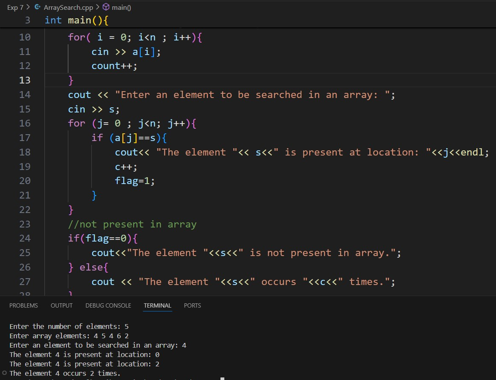

# Experiment 7
## Theory:
An array in C++ is a collection of elements of the same data type stored in contiguous memory locations. Arrays allow for the storage of multiple values under a single name and are accessed using indices. The size of an array must be specified at the time of declaration and remains fixed. The first element of an array has an index of 0, and subsequent elements are indexed sequentially.
## Program 1
### Aim: 
Create and display array using for loop
### Software used: 
Visual Studio Code
### Output:

### Conclusion:
We learned how to take array input and display it. 

## Program 2
### Aim: 
Reverse the elements of an array
### Software used: 
Visual Studio Code
### Output:

### Conclusion:
We learned how to display a reversed array. 

## Program 3
### Aim: 
Search an element in an array, and print the number of times that element occurs in the array along with the position of the component. 
### Software used: 
Visual Studio Code
### Theory:
Searching for an element in an array involves checking each element to see if it matches the target value. 
### Output:

### Conclusion:
We learned how to search an element in the array and also displayed its position along with the number of times it has occurred. 

## Program 4
### Aim: 
Find the sum and average of a given array
### Software used: 
Visual Studio Code
### Theory:
Calculating the sum and average of elements in an array involves iterating through the array to accumulate the total sum of its elements. Once the sum is obtained, the average can be calculated by dividing the sum by the number of elements in the array.
### Output:

### Conclusion:
We learned how to calculate sum and average of elements of array. 

## Program 5
### Aim: 
Find the minimum and maximum element from the given array
### Software used: 
Visual Studio Code
### Theory:
Finding the minimum and maximum elements in an array involves iterating through the array while keeping track of the smallest and largest values encountered. By comparing each element to the current minimum and maximum, the algorithm updates these values as needed. 
### Output:

### Conclusion:
We learned how to display the minimum and maximum element of the array. 
